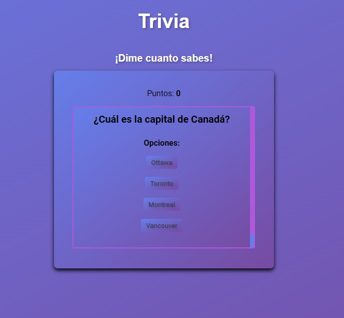
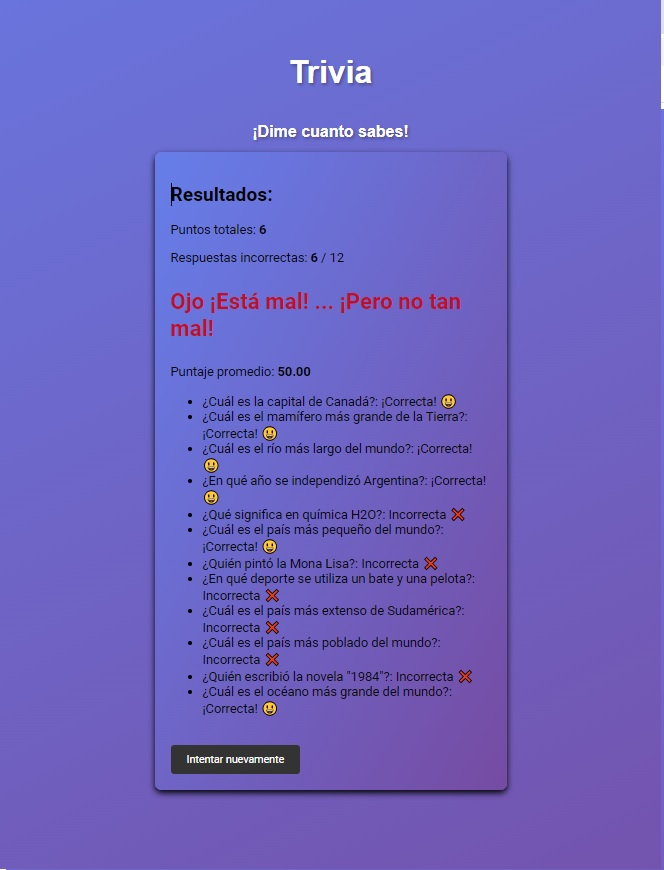
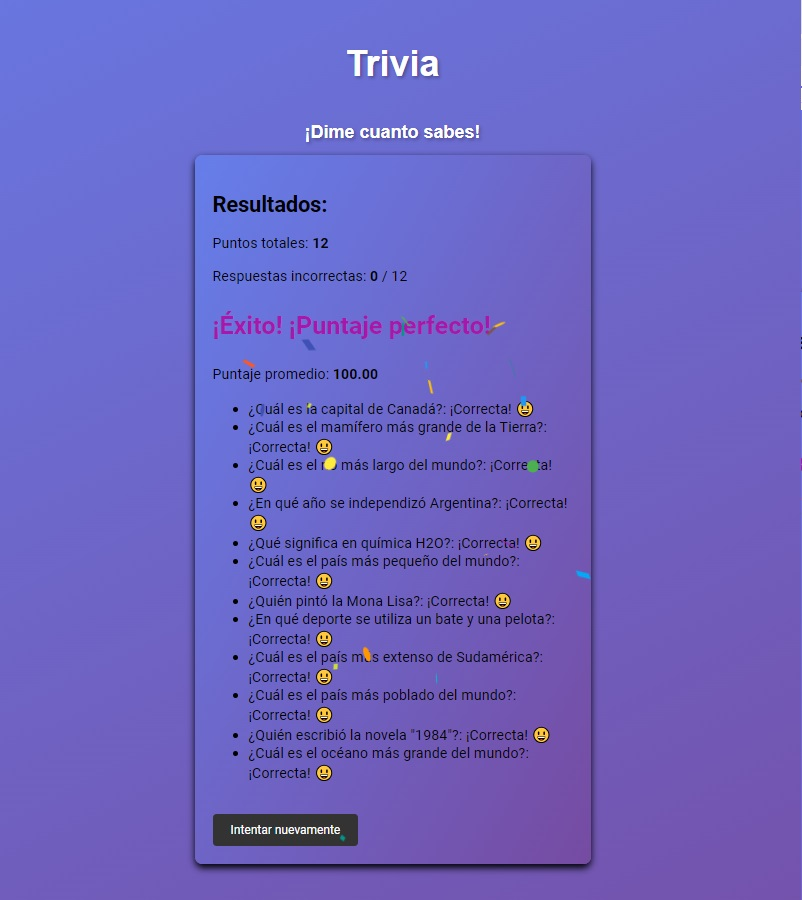
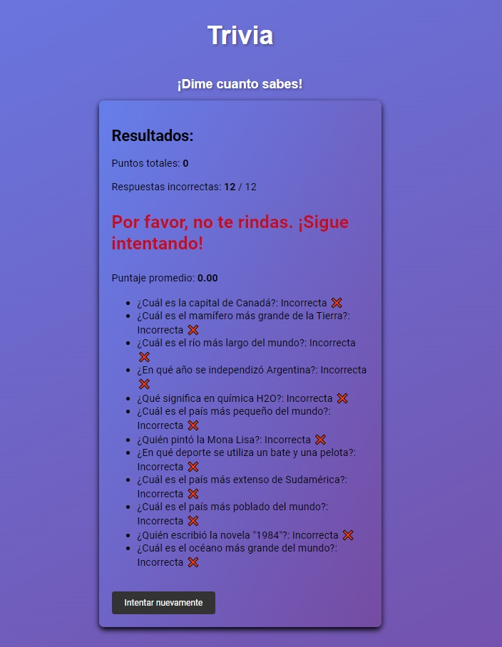

# Trivia  con React

¡Bienvenido/a a Trivia Divertida! 🎉 Realizada con React, donde podrás poner a prueba tus conocimientos y obtener un puntaje basado en tus respuestas.

## Características

- Amplia variedad de preguntas sobre diversos temas como historia, deportes, geografía, química, física, cultura, gramática, entre otros.
- Interfaz atractiva y fácil de usar.
- Retroalimentación inmediata sobre la respuesta correcta o incorrecta.
- Puntaje acumulativo a medida que avanzas en la trivia.
- Emojis e iconos para añadir un toque divertido y alegre a la experiencia.

## Capturas de pantalla

## Instalación

1. Clona este repositorio en tu máquina local.
2. Asegúrate de tener Node.js instalado.
3. Ejecuta `npm install` para instalar las dependencias.
4. Ejecuta `npm start` para iniciar la aplicación en modo de desarrollo.
5. Abre tu navegador y ve a `http://localhost:3000` para ver la aplicación en acción.

## Contribución

¡Las contribuciones son bienvenidas! Si tienes alguna idea o mejora para la aplicación, siéntete libre de hacer un fork del repositorio y abrir un pull request. También puedes informar sobre problemas o errores que encuentres en la sección de Issues.

